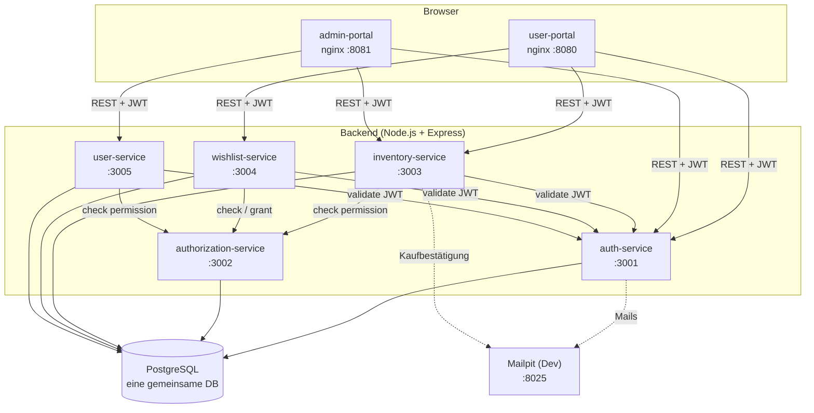
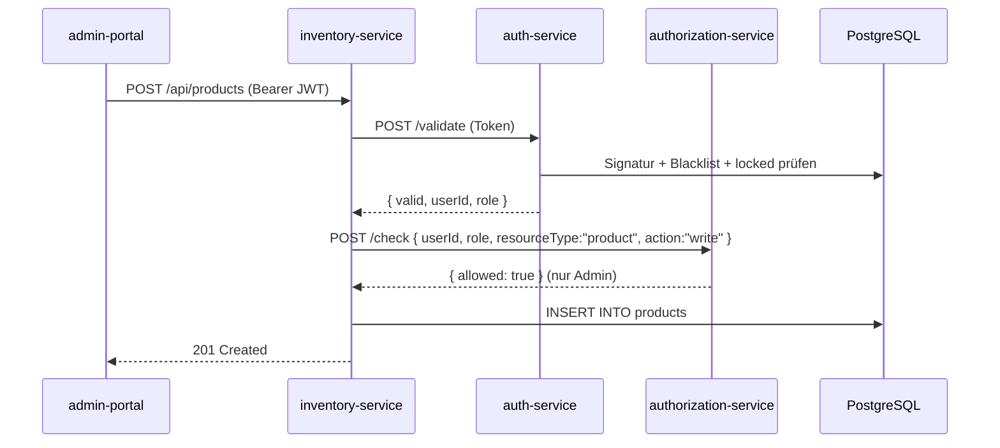

# Architektur

Microservice-Architektur des Rezeptshops. Die Diagramme rendern direkt auf GitHub (Mermaid).
Ausführliche Begründung der Entwurfsentscheidungen:
[`../planung/architecture.md`](../planung/architecture.md).

## Komponenten & Ports

## Berechtigungs-Fluss (Beispiel: Produkt anlegen)

Jeder fachliche Service prüft **nicht selbst** JWTs oder Rechte, sondern delegiert:
Token-Validierung an den `auth-service`, Rechteprüfung an den `authorization-service`.

## Kernprinzipien

- **JWT** stellt und validiert **ausschließlich** der `auth-service`. Andere Services kennen
  das `JWT_SECRET` nicht — sie rufen `POST /validate` auf.
- **Berechtigungen** prüft **ausschließlich** der `authorization-service`
  (`POST /api/authorization/check`); fachliche Services delegieren mit `userId` + `role`.
- **Eine gemeinsame PostgreSQL-Datenbank** für alle Services (kein Schema pro Service).
- **Frontends** sind reine statische Vanilla-JS-Apps, ausgeliefert über **nginx** (Volume-Mount,
  kein Build). Kommunikation mit den Services per `fetch` über CORS (`:8080`/`:8081` erlaubt).
- **Stateless**: JWT im Browser (`localStorage`); echtes Logout über `token_blacklist`.
- **Zugriffsmodell — Login für die gesamte Anwendung erforderlich (bewusste Entscheidung):**
  Es gibt **keinen anonymen Zugriff**. `login.html` (Login/Registrierung/Magic-Link) ist die
  einzige öffentlich erreichbare Seite; jede andere Seite ruft `requireLogin()` auf und leitet
  ohne gültigen Token zur Anmeldung um. Entsprechend verlangen **alle** Backend-Endpunkte ein
  gültiges JWT — auch das reine Lesen von Produkten. Die Regel „jeder darf Produkte lesen"
  bedeutet daher **jeder eingeloggte User** (nicht die anonyme Öffentlichkeit): Sie unterscheidet
  Leserechte (jeder angemeldete User) von Schreibrechten (nur Admin), nicht angemeldet vs. anonym.

Siehe auch: [`ERM.md`](ERM.md) (Datenmodell), [`../planung/CORS.md`](../planung/CORS.md) (CORS).
