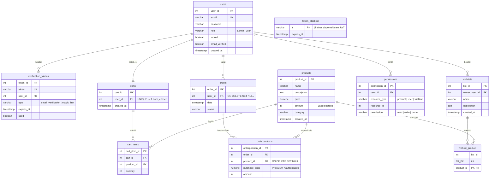

# ERM — Datenmodell

Entity-Relationship-Modell der gemeinsamen PostgreSQL-Datenbank. Das Diagramm rendert direkt
auf GitHub (Mermaid). Quelle der Wahrheit ist [`../database/init.sql`](../database/init.sql);
ausführliche Spaltenerklärungen in
[`../planung/Strukturen/Datenbankschema.md`](../planung/Strukturen/Datenbankschema.md).

## Hinweise

- **Eine gemeinsame Datenbank** für alle fünf Services (kein Schema pro Service).
- **`token_blacklist`** steht bewusst ohne FK: Die `jti` referenziert die ID eines zur
  Laufzeit ausgestellten JWT, keine andere Tabelle (Logout-Mechanismus, AUTH-4).
- **`permissions`** ist generisch: Über `resource_type` + `resource_id` deckt sie
  Produkte, User und Wunschlisten ab (Custom-Berechtigungen read/write/owner).
- **Löschverhalten:** Beim Löschen eines Users werden Korb, Tokens, Wunschlisten und
  Permissions per `CASCADE` mitentfernt; `orders.user_id` und `orderpositions.product_id`
  werden auf `NULL` gesetzt (`SET NULL`), damit die Kaufhistorie erhalten bleibt.
- Eine ältere, handgezeichnete Variante liegt als
  [`../planung/Strukturen/ERM.png`](../planung/Strukturen/ERM.png).
