# GitHub Branch Workflow – Vollständige Anleitung für Einsteiger

> Dieses Dokument erklärt unseren gemeinsamen Git-Workflow im Team von Grund auf.
> Es richtet sich an Entwickler, die noch keine oder wenig Erfahrung mit Git-Branches haben.
> Lies es einmal vollständig durch — danach macht die tägliche Arbeit mit Git viel mehr Sinn.

---

## Inhaltsverzeichnis

1. [Was ist Git überhaupt?](#1-was-ist-git-überhaupt)
2. [Was ist ein Branch?](#2-was-ist-ein-branch)
3. [Was ist der main-Branch?](#3-was-ist-der-main-branch)
4. [Was ist GitHub und was ist origin?](#4-was-ist-github-und-was-ist-origin)
5. [Was ist ein Commit?](#5-was-ist-ein-commit)
6. [Was ist ein Merge?](#6-was-ist-ein-merge)
7. [Was ist Squash und warum benutzen wir es?](#7-was-ist-squash-und-warum-benutzen-wir-es)
8. [Was ist ein Pull Request?](#8-was-ist-ein-pull-request)
9. [Der vollständige Workflow – Schritt für Schritt](#9-der-vollständige-workflow--schritt-für-schritt)
10. [Sonderfall: Nachträgliche Änderungen an einem gemergten Feature](#10-sonderfall-nachträgliche-änderungen-an-einem-gemergten-feature)
11. [Sonderfall: Kollege hat main aktualisiert, während du arbeitest](#11-sonderfall-kollege-hat-main-aktualisiert-während-du-arbeitest)
12. [Branch-Schutzregeln](#12-branch-schutzregeln)
13. [Cheat Sheet](#13-cheat-sheet)

---

## 1. Was ist Git überhaupt?

Git ist ein **Versionskontrollsystem**. Es speichert nicht einfach die aktuelle Version einer Datei, sondern die gesamte **Geschichte** aller Änderungen — wer was wann geändert hat und warum.

Stell dir Git wie ein Fotobuch vor: Jedes Mal wenn du sagst „Speichere diesen Stand", macht Git ein Foto (einen sogenannten **Commit**). Du kannst jederzeit zu einem älteren Foto zurückgehen, vergleichen was sich verändert hat, oder mehrere Entwicklungsstränge parallel verwalten.

Ohne Git würde Teamarbeit am Code so aussehen:

```
Anna speichert login.js    → überschreibt Bens Version
Ben speichert login.js     → überschreibt Annas Version
Chaos, verlorener Code
```

Mit Git arbeiten beide in eigenen **Branches** (Entwicklungssträngen) und führen ihre Änderungen kontrolliert zusammen.

---

## 2. Was ist ein Branch?

Ein Branch ist ein **paralleler Entwicklungsstrang** — wie ein Ast, der von einem Baum abzweigt.

### Die Metapher

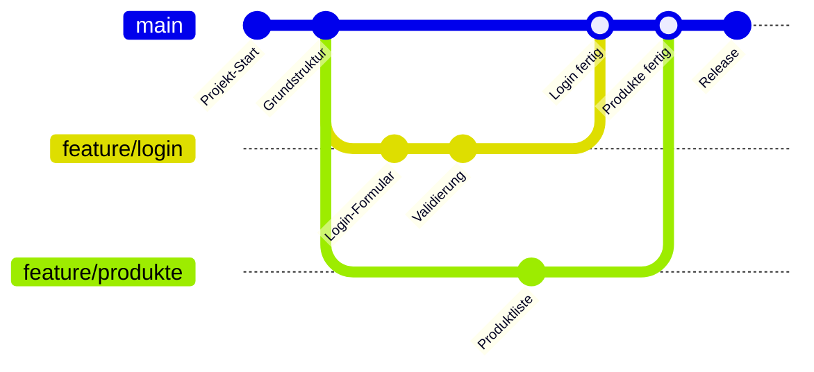

In diesem Diagramm:
- `main` ist der Hauptstrang (der „Stamm des Baumes")
- `feature/login` und `feature/produkte` sind parallele Äste
- Beide Entwickler arbeiten gleichzeitig, ohne sich gegenseitig zu behindern
- Am Ende werden die Äste wieder in `main` zusammengeführt

### Was passiert technisch?

Wenn du einen neuen Branch erstellst, macht Git intern nur eines: Es setzt einen **Zeiger** auf den aktuellen Commit und sagt „ab hier ist das ein eigener Strang". Jeder neue Commit in diesem Branch bewegt nur diesen Zeiger — `main` bleibt unverändert.

Das bedeutet: Branches sind in Git **extrem schnell und günstig** zu erstellen. Es kostet keine Kopie aller Dateien, nur einen neuen Zeiger.

### Warum separate Branches für jedes Feature?

- Du kannst jederzeit zu `main` wechseln und schauen, wie der stabile Code aussieht
- Wenn dein Feature einen Fehler hat, ist `main` nicht betroffen
- Du kannst an mehreren Features gleichzeitig arbeiten (in verschiedenen Branches)
- Ein halbfertiges Feature blockiert niemanden anderen

### Branch-Namenskonvention

```
feature/login           → Ein neues Feature: die Login-Seite
feature/warenkorb       → Ein neues Feature: der Warenkorb
bugfix/header-kaputt    → Reparatur eines bekannten Fehlers
hotfix/zahlung-crash    → Dringender Fix für einen kritischen Bug
```

**Merke:** Ein Branch = genau eine Aufgabe. Nicht mehrere unzusammenhängende Dinge in einem Branch mischen.

---

## 3. Was ist der main-Branch?

`main` ist der **Haupt-Branch** des Projekts — der einzige Branch, der immer stabilen, fertigen und funktionierenden Code enthält.

Er ist das, was am Ende zählt: abgegeben wird, deployed wird, oder anderen Entwicklern als Ausgangspunkt dient.

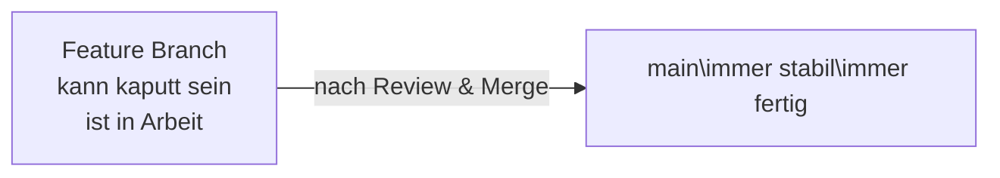

**Goldene Regel: Niemand arbeitet direkt in `main`.**

Warum diese Regel?
- Wenn zwei Personen gleichzeitig direkt in `main` arbeiten, überschreiben sie sich gegenseitig
- Ein einzelner Fehler direkt in `main` macht das gesamte Projekt kaputt
- Es gibt keine Möglichkeit, eine Änderung zu prüfen, bevor sie sichtbar wird

Deshalb erzwingen wir diese Regel nicht nur als Absprache, sondern technisch auf GitHub (siehe [Branch-Schutzregeln](#11-branch-schutzregeln)).

---

## 4. Was ist GitHub und was ist origin?

**Git** läuft auf deinem Computer — es ist das lokale Werkzeug.

**GitHub** ist ein Server im Internet, auf dem das Repository (dein Projekt mit der gesamten Git-Geschichte) gespeichert wird. GitHub ist der gemeinsame Treffpunkt für das Team.

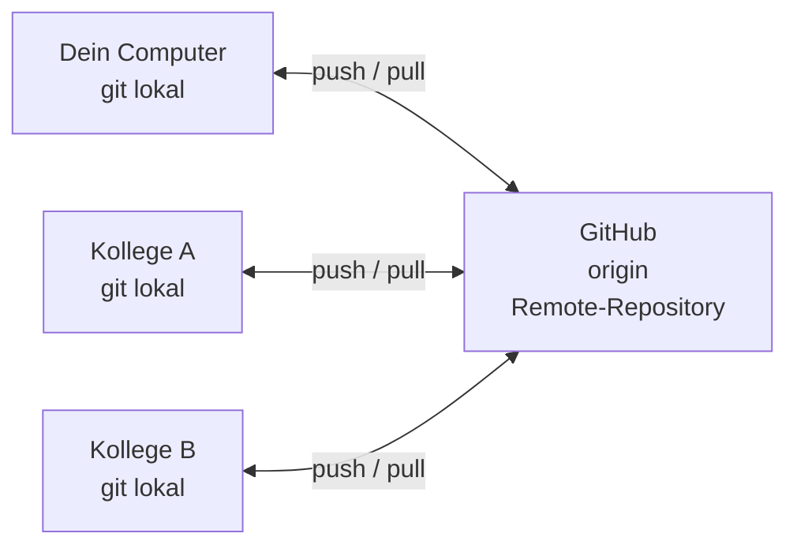

Wenn du in einem Git-Repository arbeitest, hat der GitHub-Server automatisch einen Namen: **`origin`**. Das ist einfach der Standard-Kurzname für „den Server, von dem dieses Repo ursprünglich geklont wurde".

Du wirst `origin` in Befehlen wie `git push origin feature/mein-feature` sehen — das bedeutet: „Lade meinen Branch auf den GitHub-Server hoch."

---

## 5. Was ist ein Commit?

Ein **Commit** ist eine gespeicherte Momentaufnahme deines Codes — wie ein Foto des aktuellen Zustands aller Dateien.

Jeder Commit enthält:
- Die eigentlichen Änderungen (welche Zeilen wurden hinzugefügt oder entfernt)
- Eine Nachricht, die beschreibt was und warum geändert wurde
- Einen Zeitstempel und den Autor
- Einen eindeutigen Hash (z.B. `a3f9c12`) als ID

### Der Staging-Bereich

Bevor du einen Commit machst, musst du Git sagen, **welche** Änderungen du in den Commit aufnehmen willst. Das nennt sich **Staging**.

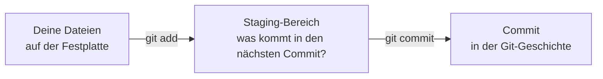

```bash
git add .
# Der Punkt "." bedeutet: alle geänderten Dateien stagen
# Alternativ einzelne Dateien: git add login.html

git commit -m "Add login form with email and password validation"
# -m steht für "message" — die Commit-Beschreibung
```

### Gute Commit-Nachrichten

Die Nachricht wird von anderen (und von dir selbst in 3 Monaten) gelesen. Sie sollte erklären, was passiert ist:

```
Gut:      "Add product detail page with image gallery"
Gut:      "Fix broken checkout button on mobile"
Gut:      "Remove unused CSS from header component"

Schlecht: "changes"    → Was wurde geändert?
Schlecht: "fix"        → Was wurde gefixt?
Schlecht: "wip"        → Das gehört noch nicht in den Verlauf
Schlecht: "asdfjkl"    → Nutzlos
```

> **Tipp:** Schreibe die Nachricht im Imperativ, auf Englisch: „Add ...", „Fix ...", „Remove ...", „Update ..."

---

## 6. Was ist ein Merge?

Ein **Merge** ist das Zusammenführen von zwei Branches. Du sagst Git: „Nimm alle Commits aus Branch A und bringe sie in Branch B."

### Merge-Typen im Vergleich

Es gibt verschiedene Arten zu mergen. Hier die zwei häufigsten — damit du verstehst, warum wir uns für Squash entschieden haben:

**Regular Merge** — alle Commits bleiben erhalten, ein zusätzlicher Merge-Commit entsteht:

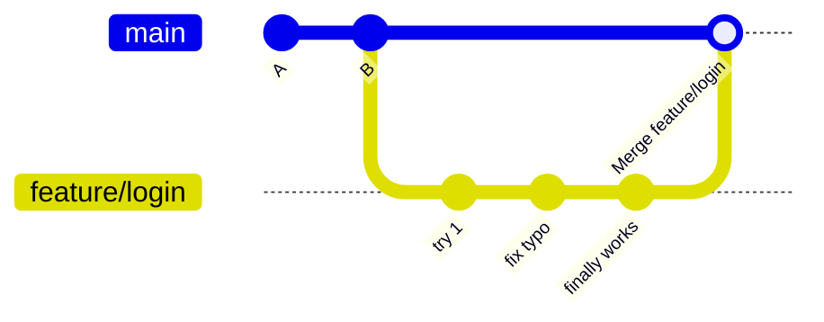

Ergebnis: `main` enthält jetzt `try 1`, `fix typo`, `finally works` und `Merge feature/login`. Die History wird unübersichtlich.

**Squash Merge** — alle Commits werden zu einem einzigen zusammengefasst:

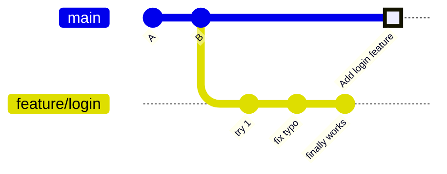

Ergebnis: `main` enthält nur einen einzigen, sauberen Commit — `Add login feature`. Der Entwicklungsprozess bleibt im Feature Branch, in `main` landet nur das Ergebnis.

---

## 7. Was ist Squash und warum benutzen wir es?

**Squash** bedeutet: mehrere Commits zu einem einzigen „zusammendrücken" (englisch: to squash = zerquetschen).

### Das Problem ohne Squash

Während du an einem Feature arbeitest, entstehen natürlicherweise viele kleine Commits:

```
commit: "start login page"
commit: "add form"
commit: "forgot to save css"
commit: "fix typo in label"
commit: "try different layout"
commit: "revert layout change"
commit: "finally works!!!"
commit: "clean up"
```

Das ist völlig normal während der Entwicklung. Aber wenn diese 8 Commits alle einzeln in `main` landen, sieht die Projektgeschichte nach kurzer Zeit so aus:

```
main-History nach 3 Features (ohne Squash):
─────────────────────────────────────────────
"clean up"
"finally works!!!"
"revert layout change"
"try different layout"
"fix typo in label"
"forgot to save css"
"add form"
"start login page"
"another try"
"wip"
"fix"
"add dashboard"
...
```

Niemand kann hier noch nachvollziehen, welche Commits zu welchem Feature gehören.

### Die Lösung: Squash and Merge

Mit Squash sieht `main` so aus:

```
main-History nach 3 Features (mit Squash):
─────────────────────────────────────────────
"Add payment integration"
"Add dashboard with sales chart"
"Add user login and registration"
```

Jeder Eintrag = ein abgeschlossenes Feature. Klar, sauber, nachvollziehbar.

### Das Beste aus beiden Welten

Der Feature Branch mit all seinen kleinen Commits bleibt auf GitHub erhalten — falls jemand wirklich in die Details schauen will. In `main` landet nur das saubere Ergebnis.

---

## 8. Was ist ein Pull Request?

Ein **Pull Request** (kurz: PR) ist eine formelle Anfrage auf GitHub: „Ich möchte meinen Branch in `main` mergen — bitte prüft meinen Code zuerst."

Der Name ist etwas verwirrend: Du bittest darum, dass jemand deine Änderungen „pullt" (holt) und in `main` aufnimmt.

### Warum nicht einfach direkt mergen?

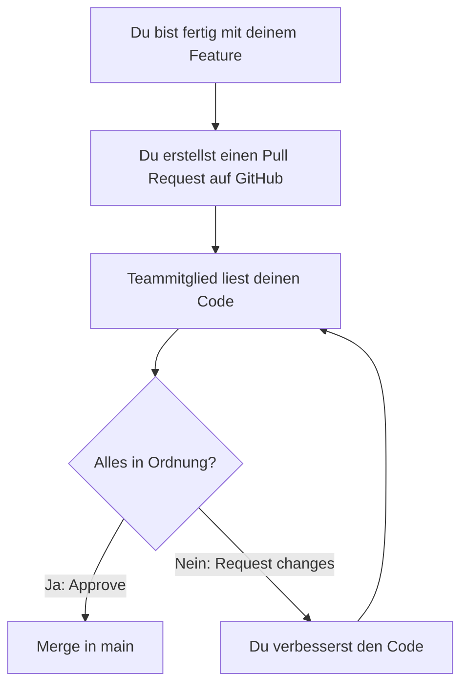

Ein PR ermöglicht:
- **Code Review:** Ein anderer Entwickler liest deinen Code und kann Fehler, Verbesserungen oder Fragen hinzufügen
- **Dokumentation:** GitHub speichert die gesamte Review-Diskussion — man kann später nachvollziehen, warum Entscheidungen so getroffen wurden
- **Sicherheit:** Kein Code landet in `main` ohne dass jemand drübergeschaut hat

---

## 9. Der vollständige Workflow – Schritt für Schritt

### Gesamtüberblick

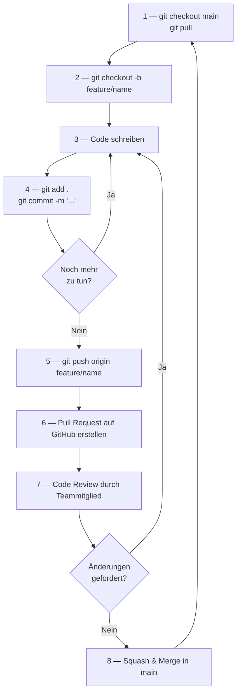

---

### Schritt 1: Den neuesten Stand von main holen

Bevor du anfängst, holst du immer den aktuellen Stand von GitHub. Andere im Team haben vielleicht seit gestern neue Features gemergt — die willst du als Ausgangspunkt haben.

```bash
git checkout main
git pull
```

Was passiert genau?

| Befehl | Bedeutung |
|---|---|
| `git checkout main` | Wechselt deinen aktiven Branch zu `main`. Falls du noch in einem alten Feature Branch warst, verlässt du ihn jetzt. |
| `git pull` | Lädt alle neuen Commits vom GitHub-Server herunter und wendet sie auf deinen lokalen `main` an. Synchronisiert deinen Computer mit GitHub. |

> **Wichtig:** Diesen Schritt nie überspringen. Wenn du einen Feature Branch von einem veralteten `main` abzweigst, fehlen dir Änderungen deiner Kollegen — das führt später zu Konflikten.

---

### Schritt 2: Einen neuen Feature Branch erstellen

Jetzt erstellst du deinen eigenen Branch für deine Aufgabe.

```bash
git checkout -b feature/mein-feature
```

Was passiert genau?

| Befehl-Teil | Bedeutung |
|---|---|
| `git checkout` | Wechselt zu einem Branch |
| `-b` | Die Option `-b` steht für „branch" — erstelle einen **neuen** Branch (ohne `-b` wechselst du nur zu einem bestehenden) |
| `feature/mein-feature` | Der Name des neuen Branches — wähle einen beschreibenden Namen |

Nach diesem Befehl:
- Du bist in deinem eigenen Branch
- Alle Commits, die du jetzt machst, landen nur in diesem Branch
- `main` bleibt unverändert

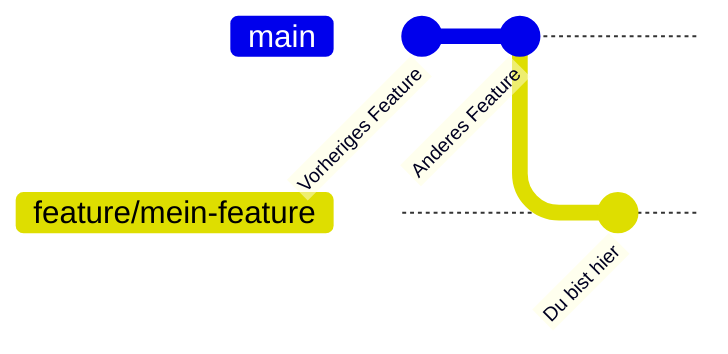

---

### Schritt 3 & 4: Arbeiten und Commits machen

Jetzt programmierst du dein Feature. Mache regelmäßig Commits — nicht nur am Ende.

```bash
# Nachdem du etwas fertig gebaut hast:
git add .
git commit -m "Add product listing with price and image"

# Weiter arbeiten, dann wieder:
git add .
git commit -m "Add filter by category to product listing"
```

Was passiert genau?

| Befehl | Bedeutung |
|---|---|
| `git add .` | Staged alle geänderten Dateien. Der Punkt `.` steht für „alle Dateien im aktuellen Verzeichnis". |
| `git commit -m "..."` | Erstellt einen Commit mit der angegebenen Nachricht. Der aktuelle Stand aller gestagten Dateien wird dauerhaft in der Git-Geschichte gespeichert. |

> **Tipp:** Committe jedes Mal, wenn du einen kleinen, funktionierenden Schritt abgeschlossen hast — nicht erst wenn das ganze Feature fertig ist. So kannst du bei Bedarf zu einem früheren Zwischenstand zurück.

---

### Schritt 5: Den Branch auf GitHub hochladen (Pushen)

Deine Commits existieren bisher nur auf deinem Computer. Um sie mit dem Team zu teilen (und zu sichern), lädst du den Branch auf GitHub hoch.

```bash
git push origin feature/mein-feature
```

Was passiert genau?

| Befehl-Teil | Bedeutung |
|---|---|
| `git push` | Überträgt lokale Commits auf den Remote-Server |
| `origin` | Der Name des GitHub-Servers (Standard-Kurzname) |
| `feature/mein-feature` | Der Branch, der hochgeladen werden soll |

Nach dem ersten Push existiert dein Branch auf GitHub und ist für alle Teammitglieder sichtbar.

> Beim allerersten Push eines neu erstellten Branches sagt Git manchmal:
> `fatal: The current branch has no upstream branch.`
> Dann einmalig eingeben:
> `git push --set-upstream origin feature/mein-feature`
> Danach reicht wieder `git push`.

---

### Schritt 6: Pull Request auf GitHub erstellen

Sobald du fertig bist und deinen Branch gepusht hast, gehst du auf GitHub und erstellst einen Pull Request.

1. Öffne das Repository auf github.com
2. GitHub zeigt in der Regel automatisch einen Banner oben: _„You recently pushed to `feature/mein-feature` — Compare & pull request"_ — klicke darauf
3. Alternativ: Tab **„Pull requests"** → **„New pull request"**
4. Stelle sicher: `base: main`, `compare: feature/mein-feature`
5. Schreibe Titel und kurze Beschreibung: Was hast du gebaut? Warum? Gibt es Besonderheiten beim Review?
6. Klicke auf **„Create pull request"**

Das Team wird benachrichtigt und kann deinen Code reviewen.

---

### Schritt 7: Code Review abwarten und auf Feedback reagieren

Ein Teammitglied liest deinen Code auf GitHub durch. Es kann:
- Den PR **approven** (genehmigen) — alles passt
- **Kommentare** hinterlassen — Fragen oder Anmerkungen
- **Changes requesten** — konkrete Änderungen fordern

Falls Änderungen gefordert werden:
1. Gehe zurück in deinen lokalen Branch
2. Mache die Änderungen
3. `git add .` und `git commit -m "..."`
4. `git push origin feature/mein-feature`

Der Pull Request auf GitHub wird **automatisch aktualisiert** — kein neuer PR nötig.

---

### Schritt 8: Squash & Merge

Sobald der PR genehmigt ist, wird er in `main` gemergt.

Wir verwenden ausschließlich **Squash and Merge** (auf GitHub: Button „Squash and merge").

Was dabei passiert:
1. Alle deine Commits im Feature Branch werden zu einem einzigen zusammengefasst
2. Dieser eine Commit landet in `main`
3. GitHub schlägt als Commit-Nachricht deinen PR-Titel vor — diesen ggf. noch präzisieren
4. Der Feature Branch kann danach gelöscht werden (GitHub fragt direkt danach)

---

## 10. Sonderfall: Nachträgliche Änderungen an einem gemergten Feature

Ein Feature wurde gemergt und ist in `main`. Jetzt gibt es einen Bug oder eine Verbesserung. Was nun?

**Wichtig: Den alten, bereits gemergten Feature Branch niemals reaktivieren und weiterverwenden.**

Warum? Weil dieser Branch auf einem alten Stand von `main` basiert. Seit dem Merge können andere Features in `main` gelandet sein. Wenn du vom alten Branch aus weiterarbeitest, fehlen dir all diese Änderungen und es entstehen Konflikte.

### Der richtige Weg: Neuen Branch vom aktuellen main

```bash
# 1. Zum aktuellen main wechseln
git checkout main

# 2. Den neuesten Stand holen
git pull

# 3. Neuen Branch für die Nachbesserung erstellen
git checkout -b bugfix/login-validierung
# oder für eine Erweiterung:
git checkout -b feature/login-passwort-reset
```

### Visualisierung: Richtig vs. Falsch

**Falsch — alten Branch weiterverwenden:**

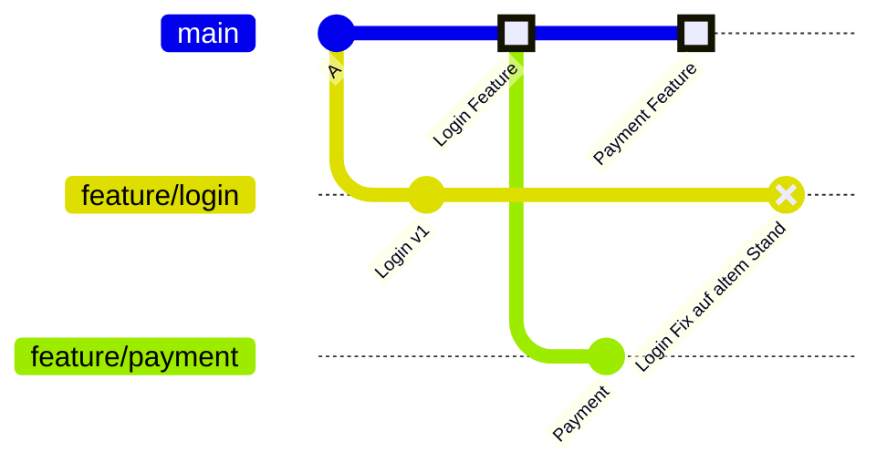

Der alte `feature/login`-Branch weiß nichts vom Payment-Feature und anderen Änderungen in `main`.

**Richtig — neuen Branch von aktuellem main:**

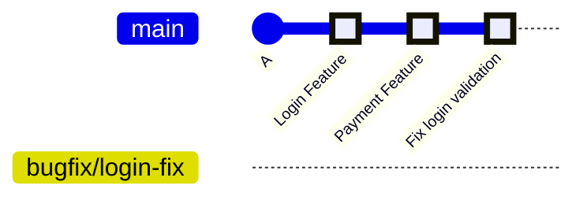

Der neue Branch startet vom aktuellen `main` — alle bisherigen Features sind enthalten.

### Die Regel

```
Feature gemergt → Branch hat seinen Zweck erfüllt → Branch löschen
Neue Aufgabe am selben Bereich → Neuen Branch von aktuellem main erstellen
```

---

## 11. Sonderfall: Kollege hat main aktualisiert, während du arbeitest

Du arbeitest in deinem Feature Branch — und währenddessen mergt ein Kollege sein fertiges Feature in `main`. Dein Branch weiß von dieser Änderung nichts. Was passiert, und was musst du tun?

### Das Problem visualisiert

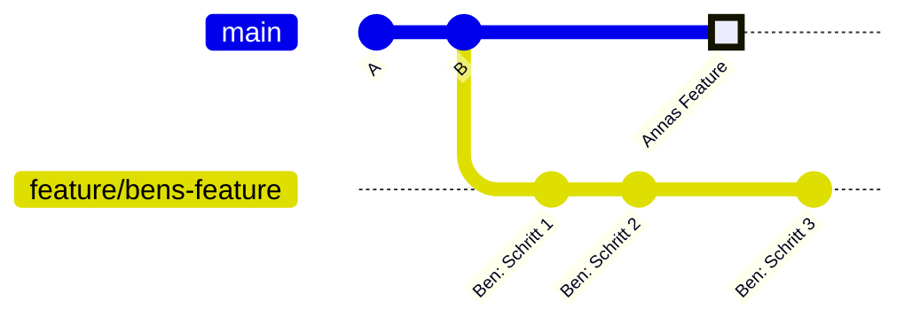

Ben ist in `feature/bens-feature` und arbeitet weiter. `main` ist durch Annas Merge aber schon einen Schritt weiter. Bens Branch und `main` haben sich auseinanderbewegt.

### Wann ist das ein Problem?

Nicht immer. Zwei Situationen:

**Kein Konflikt:** Anna hat `checkout.html` geändert, Ben arbeitet an `login.html`. Dieselben Dateien wurden nicht angefasst. GitHub kann das beim Merge automatisch zusammenführen — Ben muss nichts tun.

**Konflikt:** Anna und Ben haben beide `header.css` geändert — an denselben Zeilen. GitHub weiß nicht, welche Version die richtige ist. Das nennt sich ein **Merge-Konflikt**. Ben muss ihn manuell lösen.

### Weg 1: Einfach weitermachen (empfohlen, wenn kein Konflikt erwartet)

Ben macht nichts. Er committet und pusht wie gewohnt, erstellt seinen PR. GitHub zeigt beim PR automatisch an, ob Konflikte existieren oder nicht.

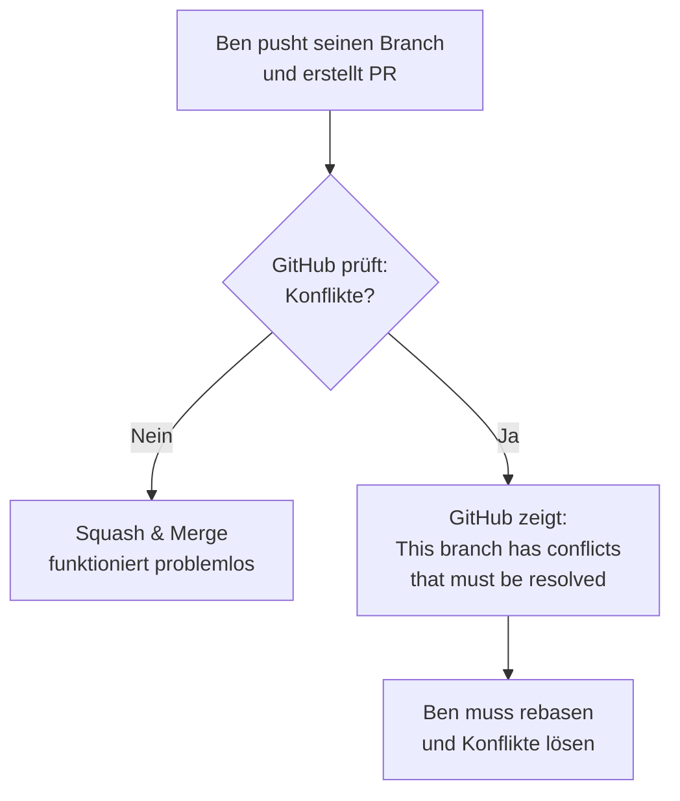

### Weg 2: Den eigenen Branch auf aktuellen main updaten (Rebase)

Wenn Ben weiß, dass er Annas Änderungen braucht, oder wenn GitHub Konflikte meldet, führt er einen **Rebase** durch.

**Was ist ein Rebase?**
Rebase bedeutet: „Setze meine Commits auf die Spitze des aktuellen `main`." Git nimmt Bens Commits temporär zur Seite, aktualisiert den Ausgangspunkt auf das aktuelle `main`, und setzt Bens Commits dann obendrauf.

**Vorher — Bens Branch basiert auf einem alten Stand:**

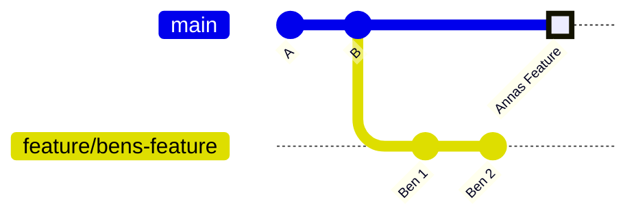

**Nachher — nach dem Rebase sieht es aus, als hätte Ben erst nach Anna angefangen:**

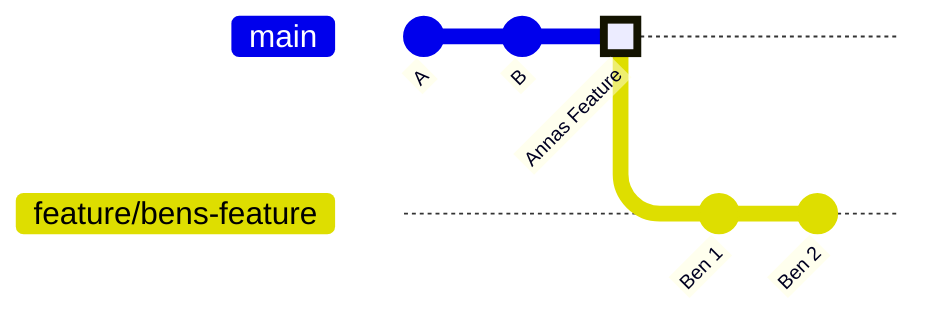

### Schritt für Schritt: Rebase durchführen

```bash
# Schritt 1: Neuesten Stand von GitHub holen
git fetch origin
# "fetch" lädt neue Informationen von GitHub herunter,
# wechselt aber NICHT den Branch und merged nichts — nur herunterladen.

# Schritt 2: Bens Commits auf den aktuellen main aufsetzen
git rebase origin/main
# "origin/main" = der main-Stand auf GitHub (nicht dein lokaler main)
# Git setzt jetzt Bens Commits Stück für Stück auf das aktuelle main auf.
```

#### Was passiert während des Rebase?

**Fall A: Kein Konflikt**

Git meldet `Successfully rebased` — fertig. Ben kann einfach weiterarbeiten und pushen.

**Fall B: Konflikt**

Git stoppt und zeigt, welche Datei einen Konflikt hat:

```
CONFLICT (content): Merge conflict in src/header.css
error: could not apply abc1234... Ben: Schritt 1
hint: Resolve all conflicts manually, mark them as resolved with
hint: "git add/rm <conflicted_files>", then run "git rebase --continue".
```

Git markiert den Konflikt direkt in der Datei:

```
<<<< HEAD   (Annas Version — der aktuelle main-Stand)
.header { background: blue; }
====
.header { background: red; }
>>>> abc1234  (Bens Commit)
```

Ben entscheidet, welche Version richtig ist (oder kombiniert beide), löscht alle Markierungszeilen und speichert. Dann:

```bash
# Konflikt als gelöst markieren
git add src/header.css

# Rebase fortsetzen — Git wendet den nächsten Commit an
git rebase --continue

# Falls du den Rebase abbrechen und zum Ausgangszustand zurück willst:
git rebase --abort
```

#### Nach dem Rebase: Force Push nötig

Da der Rebase die Commits technisch neu geschrieben hat (neuer Ausgangspunkt), muss Ben seinen Branch mit einem speziellen Push aktualisieren:

```bash
git push --force-with-lease origin feature/bens-feature
# "--force-with-lease" ist sicherer als "--force":
# Es pusht nur, wenn niemand sonst seit deinem letzten Push in den Branch gepusht hat.
```

> **Wichtig:** `--force-with-lease` nur auf dem eigenen Feature Branch verwenden — niemals auf `main`. Auf `main` ist force push durch die Branch Protection Regeln ohnehin geblockt.

### Entscheidungshilfe

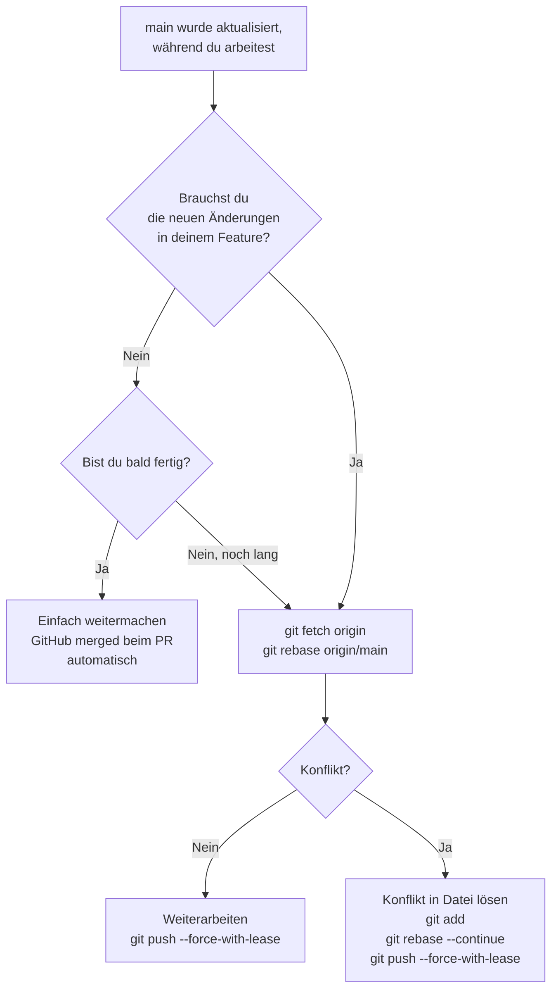

---

## 12. Branch-Schutzregeln

Auf GitHub haben wir für `main` technische Schutzregeln eingestellt, die verhindern, dass jemand gegen den Workflow verstößt:

| Regel | Was sie verhindert | Warum sie wichtig ist |
|---|---|---|
| **Require pull request before merging** | Direktes Pushen in `main` | Kein Code landet ohne Review in main |
| **Required approvals: 1** | Merge ohne Zustimmung | Mindestens eine weitere Person muss den Code gesehen haben |
| **Block force pushes** | `git push --force` auf main | Verhindert, dass jemand die Git-Geschichte manipuliert |
| **Restrict deletions** | `git branch -d main` | `main` kann nicht versehentlich gelöscht werden |
| **Squash only** | Regular Merge oder Rebase Merge | Nur Squash-Merges erlaubt — saubere, lineare History |
| **Require linear history** | Merge-Commits | Die main-Geschichte bleibt als gerade Linie lesbar |

Diese Regeln sind kein Misstrauen gegenüber dem Team. Sie sind ein Sicherheitsnetz, das uns alle schützt — auch vor eigenen Flüchtigkeitsfehlern.

---

## 13. Cheat Sheet

```bash
# ─────────────────────────────────────────────
# NEUES FEATURE STARTEN
# ─────────────────────────────────────────────

# 1. Zum main wechseln und aktuellen Stand holen
git checkout main
git pull

# 2. Neuen Feature Branch erstellen
git checkout -b feature/mein-feature

# ─────────────────────────────────────────────
# WÄHREND DER ENTWICKLUNG (beliebig oft wiederholen)
# ─────────────────────────────────────────────

# 3. Geänderte Dateien stagen
git add .

# 4. Commit erstellen
git commit -m "Beschreibung was du gemacht hast"

# 5. Branch auf GitHub hochladen (nach dem ersten Mal reicht git push)
git push origin feature/mein-feature

# ─────────────────────────────────────────────
# NACH DEM PUSH: Auf GitHub Pull Request erstellen
# → Review abwarten → ggf. Änderungen machen → Squash & Merge
# ─────────────────────────────────────────────

# ─────────────────────────────────────────────
# NACHTRÄGLICHE ÄNDERUNG AN BEREITS GEMERGTEM FEATURE
# ─────────────────────────────────────────────

git checkout main
git pull
git checkout -b bugfix/beschreibung-des-bugs
# → dann wieder: add, commit, push, PR

# ─────────────────────────────────────────────
# KOLLEGE HAT MAIN AKTUALISIERT — BRANCH UPDATEN (REBASE)
# ─────────────────────────────────────────────

# Neuesten Stand von GitHub holen (ohne Branch zu wechseln)
git fetch origin

# Eigene Commits auf aktuellen main aufsetzen
git rebase origin/main

# Falls Konflikte: Datei bearbeiten, dann:
git add <konflikt-datei>
git rebase --continue

# Falls Rebase abbrechen:
git rebase --abort

# Nach erfolgreichem Rebase pushen
git push --force-with-lease origin feature/mein-feature

# ─────────────────────────────────────────────
# NÜTZLICHE ZUSATZBEFEHLE
# ─────────────────────────────────────────────

# Welchen Branch bin ich gerade?
git branch

# Alle Branches anzeigen (auch Remote)
git branch -a

# Status der aktuellen Änderungen anzeigen
git status

# Commit-History anzeigen
git log --oneline
```

---

## Die wichtigsten Merksätze

1. **Nie direkt in `main` arbeiten** — immer von einem aktuellen `main` abzweigen und einen eigenen Branch erstellen
2. **Ein Branch = eine Aufgabe** — keine unzusammenhängenden Änderungen mischen
3. **Squash hält die History sauber** — in `main` landet pro Feature genau ein klarer Commit
4. **Nach einem Merge: neuen Branch von frischem `main` starten** — nie einen alten, bereits gemergten Branch reaktivieren
5. **Committe früh und oft** — kleine Commits während der Entwicklung, ein sauberer Squash-Commit in `main`
